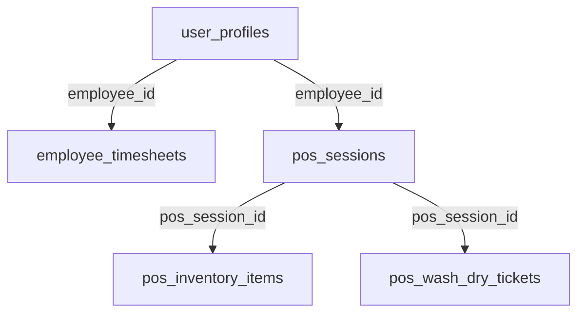

# Laundry King POS - Architectural Rules and Structure

## Core Architecture Principle: OFFLINE-FIRST

This application is designed to be **strictly offline-first**. All operations must work without an internet connection, with server synchronization occurring ONLY through explicit user action via the "Save Progress" button.

## Tech Stack
- Frontend: React + Vite
- Styling: Tailwind CSS
- Backend: Supabase (PostgreSQL)
- Local Storage: IndexedDB/localStorage

## Database Schema and Relationships



### Tables Structure

#### user_profiles (Central Employee Table)
- `id` (uuid) PRIMARY KEY
- `full_name`
- `email`
- `role`

#### employee_timesheets
- Links to `user_profiles` via `employee_id`
- Tracks clock in/out times and work duration

#### pos_sessions
- Links to `user_profiles` via `employee_id`
- Tracks cash, totals, session status

#### pos_inventory_items
- Links to `pos_sessions` via `pos_session_id`
- Tracks item counts, sales, stock

#### pos_wash_dry_tickets
- Links to `pos_sessions` via `pos_session_id`
- Tracks ticket numbers, amounts

## Critical Data Flow Rules

1. ALL operations MUST save to local storage first
2. NO automatic server connections or background syncs
3. Server sync ONLY happens on explicit "Save Progress" button click
4. Sync process:
   - Get employee_id from user_profiles
   - Create/update pos_session
   - Link inventory items and tickets to session
   - Update employee timesheet if needed

## Data Integrity Requirements

1. Every operation must work without server connection
2. All server sync operations must be atomic
3. All relationships must be preserved during sync
4. Data integrity must be maintained in both offline and online states

## File Structure

```
src/
├── services/
│   ├── localDB.js       # Handles all local storage operations
│   ├── posService.js    # POS operations and sync logic
│   └── timesheetService.js # Timesheet operations and sync
├── pages/
│   ├── employee-pos-terminal/   # Main POS interface
│   ├── admin-login/            # Admin access
│   └── operations-overview-dashboard/ # Operations view
└── contexts/
    └── AuthContext.jsx  # Authentication state management
```

## Critical Implementation Notes

1. NO direct server calls outside of "Save Progress"
2. ALL data mutations must go through localDB first
3. ALL relationships must be maintained locally before sync
4. Sync operations must handle offline-to-online transition gracefully
5. Error handling must preserve local data integrity

## Validation Checklist

Before any code changes:
- [ ] Does it work completely offline?
- [ ] Does it save to local storage first?
- [ ] Are all relationships maintained locally?
- [ ] Is sync only triggered by "Save Progress"?
- [ ] Are all error states handled locally?

## Last Updated
2025-09-27