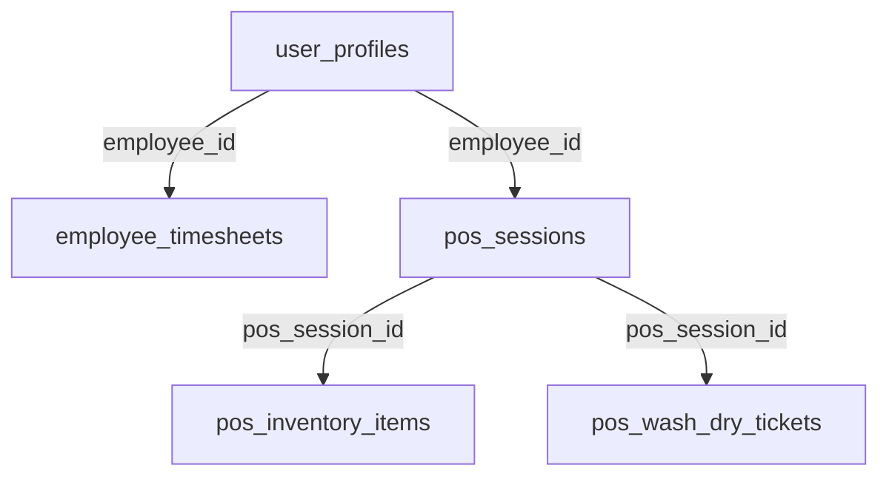

# Laundry King POS - Architectural Rules and Structure

## Core Architecture Principle: OFFLINE-FIRST

This application is designed to be **strictly offline-first**. All operations must work without an internet connection, with server synchronization occurring ONLY through explicit user action via the "Save Progress" button.

## Core Development Rules

1. NEVER remove or modify working functions/logic when fixing unrelated issues
2. Focus ONLY on the specific issue reported and avoid making unnecessary changes
3. When fixing bugs, preserve all working functionality to prevent reintroducing fixed issues

## Tech Stack

- Frontend: React + Vite
- Styling: Tailwind CSS
- Backend: Supabase (PostgreSQL)
- Local Storage: IndexedDB/localStorage

## Database Schema and Relationships



### Tables Structure

#### user_profiles (Central Employee Table)

- `id` (uuid) PRIMARY KEY
- `full_name`
- `email`
- `role`

#### employee_timesheets

- Links to `user_profiles` via `employee_id`
- Tracks clock in/out times and work duration

#### pos_sessions

- Links to `user_profiles` via `employee_id`
- Tracks cash, totals, session status

#### pos_inventory_items

- Links to `pos_sessions` via `pos_session_id`
- Tracks item counts, sales, stock

#### pos_wash_dry_tickets

- Links to `pos_sessions` via `pos_session_id`
- Tracks ticket numbers, amounts

## Critical Data Flow Rules

1. ALL operations MUST save to local storage first
2. NO automatic server connections or background syncs
3. Server sync ONLY happens on explicit "Save Progress" button click
4. Sync process:
   - Get employee_id from user_profiles
   - Create/update pos_session (with actual notes from UI)
   - Link inventory items and tickets to session (always use a valid session id, create new if needed)
   - Update employee timesheet if needed

## Data Integrity Requirements

1. Every operation must work without server connection
2. All server sync operations must be atomic
3. All relationships must be preserved during sync
4. Data integrity must be maintained in both offline and online states

## File Structure

```
src/
├── services/
│   ├── localDB.js       # Handles all local storage operations
│   ├── posService.js    # POS operations and sync logic
│   └── timesheetService.js # Timesheet operations and sync
├── pages/
│   ├── employee-pos-terminal/   # Main POS interface
│   ├── admin-login/            # Admin access
│   └── operations-overview-dashboard/ # Operations view
└── contexts/
    └── AuthContext.jsx  # Authentication state management
```

## Critical Implementation Notes

1. NO direct server calls outside of "Save Progress"
2. ALL data mutations must go through localDB first
3. ALL relationships must be maintained locally before sync
4. Sync operations must handle offline-to-online transition gracefully
5. Error handling must preserve local data integrity
6. Employee selection and clock-in state are persisted and restored across refreshes using localStorage/localDB.
7. Notes are saved to localDB and Supabase, and restored on refresh/employee change.
8. On Save Progress, both employees and inventory are fetched and saved to localDB if empty, and uploaded to Supabase if changed.
9. Only the latest inventory record per item is saved to localDB and displayed.
10. Inventory uploads always use a valid session id, creating a new session if needed for history.
11. UI never falls back to 'Select employee' if a valid selection exists.

## Validation Checklist

Before any code changes:

- [ ] Does it work completely offline?
- [ ] Does it save to local storage first?
- [ ] Are all relationships maintained locally?
- [ ] Is sync only triggered by "Save Progress"?
- [ ] Are all error states handled locally?
- [ ] Are notes, employee selection, and clock-in state persisted across refreshes?
- [ ] Is only the latest inventory record per item shown?
- [ ] Will the changes preserve existing working functionality?
- [ ] Are the changes focused only on the reported issue?
- [ ] Have all working functions/logic been preserved?

## Componentization & UI Structure

To ensure maintainability, token efficiency, and strict offline-first logic, the UI is being refactored into dedicated components:

- `EmployeeSelect`: Handles employee selection, prompts if no employees loaded, and disables fallback logic. Used in POS terminal UI. Selection is persisted and restored.
- `InventoryGrid`: Displays and manages inventory items, separated for clarity and reuse. On employee change, start is set to left for correct shift handoff.
- `SaveProgressButton`: Encapsulates the explicit sync/save logic, ensuring all data is saved locally before server sync.
- Other UI elements (CashSection, TotalsSection, NotesSection, Numpad) are also modularized for clarity and separation of concerns.

**Componentization Rules:**

- All business logic should be separated into service files (e.g., EmployeeService, InventoryService, TimesheetService).
- UI components should be stateless where possible, receiving all data and handlers via props.
- No direct server calls inside UI components; all sync logic is handled by service layer and triggered only by SaveProgressButton.
- Employee selection must prompt if no employees are loaded, with no fallback employees allowed. Selection is persisted and restored.
- All relationships and data integrity must be maintained locally before any sync.

**Validation Checklist for Components:**

- [ ] Is the component stateless and reusable?
- [ ] Does it avoid direct server calls?
- [ ] Does it follow offline-first logic?
- [ ] Is error handling robust and local?
- [ ] Is it documented in .rules.md?
- [ ] Are existing working functions preserved?
- [ ] Are changes focused only on the specific issue?
- [ ] Is all working functionality maintained?

## Last Updated

2025-10-05